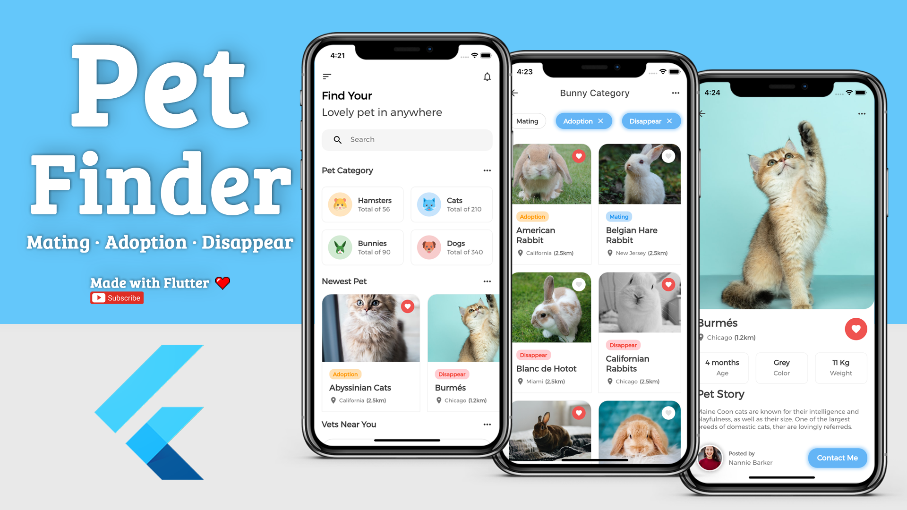
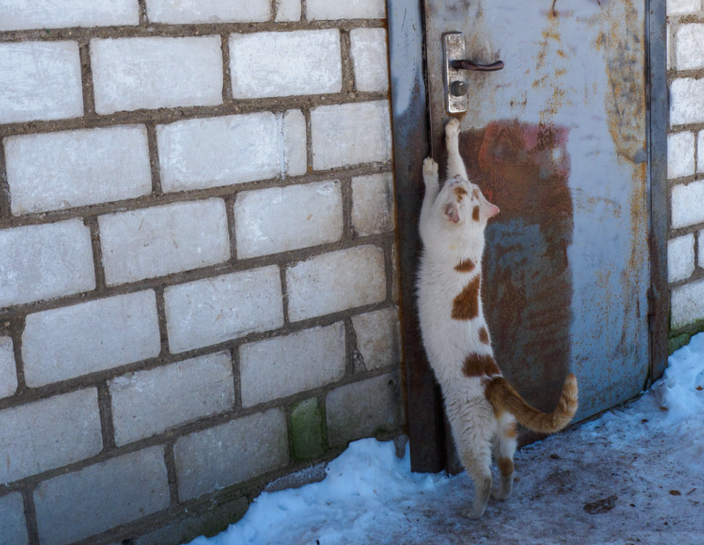

# Pet Finder

Все любят котиков!

Если ты можешь помочь, ты должен помочь!

Pet project with Flutter + Firebase + Hasura.



## How to Start

```
$ flutter packages pub run build_runner build --delete-conflicting-outputs
$ cd data && docker-compose up -d
```

## For VSCode Apollo GraphQL (deprecated)

```
$ npm install -g apollo graphql
```

create `./apollo.config.js`

```js
module.exports = {
  client: {
    includes: ['./lib/**/*.dart'],
    service: {
      name: '<project name>',
      url: '<graphql endpoint>',
      // optional headers
      headers: {
        'x-hasura-admin-secret': '<secret>',
        'x-hasura-role': 'user',
      },
      // optional disable SSL validation check
      skipSSLValidation: true,
      // alternative way
      // localSchemaFile: './schema.graphql',
    },
  },
}
```

how to download `schema.json` for `localSchemaFile`

```
$ apollo schema:download --endpoint <graphql endpoint> --header 'X-Hasura-Admin-Secret: <secret>' --header 'X-Hasura-Role: user'
```

## For VSCode Apollo Rover

```
$ npm install -g @apollo/rover
$ rover graph introspect http://localhost:8080/v1/graphql > schema.graphql
```

## Оптимизация времени сборки Firebase iOS SDK

https://github.com/invertase/firestore-ios-sdk-frameworks

## How to save DB-Schema

```
$ cd data
$ rm -rf migrations
$ hasura migrate create "init" --from-server --database-name default
$ rm -rf metadata
$ hasura metadata export
```

## How to restore DB-Schema

```
$ cd data
$ hasura migrate apply
$ hasura metadata apply
```

or

```
$ cd data
$ cat backup.sql | docker exec -i data-postgres-1 psql -U postgres
$ hasura metadata apply
```

## How to backup data

curl --location --request POST 'http://localhost:8080/v1alpha1/pg_dump' --header 'x-hasura-admin-secret: <password>' --header 'Content-Type: application/json' --data-raw '{ "opts": ["-O", "-x", "--schema", "public", "--schema", "auth"], "clean_output": true}' -o backup.sql

## 👨‍🎨 Inspiration

- https://github.com/gerfagerfa/pet_finder
- https://github.com/comerc/flutter_idiomatic

Hope you guys enjoy it !  
:wave::wave::wave:

## Contacts

- E-Mail: [andrew.kachanov@gmail.com](mailto:andrew.kachanov@gmail.com)
- Telegram: [@AndrewKachanov](https://t.me/AndrewKachanov)

## Support Me

- [Patreon](https://www.patreon.com/comerc)
- [QIWI](https://donate.qiwi.com/payin/comerc)

## More Info

Это выпускная работа моих курсов по Flutter. Набрал группу учеников, мы занимались 3 месяца (всю осень 2020). Преследовал цель прокачать пробелы - учитель учится у своих учеников. Теперь умею готовить идиоматичный код, написал заметку: https://habr.com/ru/post/528106/

Как промежуточный этап для основного проекта, смотрите https://github.com/comerc

😺 We love cats!

## YouTube-каналы про бездомных котиков

- https://www.youtube.com/c/KatuChikSik

## Фонды

- https://rayfund.ru/animals/
- https://www.fond-nika.ru/ourpets
- https://www.fund4dogs.ru/index.php/nashi-pitomtsy

## Как платформа для волонтёрской инициативы по пропитанию?

Наткнулся на [Авито](https://www.avito.ru/kaliningrad/tovary_dlya_zhivotnyh/othody_ryby_2467581862):

Отходы от рыбы пиламиды, много мясо остаётся головы хвосты и тд..
Каждую неделю можно забирать минимум по 10 мешков, в один мешок отходы от 10-12 рыб. Рыба свежая всегда, привоз каждую неделю бывает и два раза в неделю, отдаём замороженную, в дороге не по течёт, это огромный плюс, может кому нужно для животных, другие берут для одобрения, да и другие делают котлеты.. и тд.. без разницы. Адрес: Калининград, Александра Невского 44, Магазин Пингвин 39, вывиска большая хорошо видно, есть парковка, если буду свободным помогу загрузить без проблем.
!!( Многие звонят и пишут думают что отдаём рыбу как на первой фотки, но мы отдаём отходы от рыбы !)) отходы на второй фотки...))) в несколько плёночных мешков.
Спасибо))
Я создал группу в ватсапе оставьте ваш номер и я вас добавлю и там о бо всём договоримся.

## Draft v2

[Mind Map](https://miro.com/app/board/uXjVONvbOHQ=/)

- В рамках программы "весеннее обострение - котики за 50 дней"
- Фокус: спасение питомцев от бездомной жизни (и ничего более)
- Только котики и собачки (тяжело набрать критическую массу по другим питомцам)
- Преемственность к v1 - вёрстка и state management
- Переиспользование minsk8 - картография, animation, flutter_candies
- Применение наработок flutter_idiomatic - соглашения и тесты (Unit, Widget, Integration)
- Концепция "from zero to hero" - от нового branch-а к релизу на FlutterFlow & Hasura
- Релизы: iOS, Android, FlutterWeb, SEO-web, telegram-bot, админка (отдельно), комьюнити (discourse.org)
- Вовлечённость: не животные, а питомцы (с именами); не пользователи, а соучастники
- Функционал:
  - onboarding - краткое представление платформы
  - лента питомцев с сортировкой (новые / популярные)
  - блог питомца
  - избранное
  - фасетный поиск (с отрицанием)
  - категории (таксономия)
  - гео-поиск
  - нотификация по сохранённым критериям поиска (рыбалка)
  - роли: волонтёр, хозяин, модератор, администратор
  - аутентификация и профиль для соучастников
  - top волонтёров (с защитой от читерства - только пристроенные питомцы)
  - лента новых постов в блогах питомцев - 15 минут славы Энди Уорхола
  - личная переписка между волонтёром и хозяином с формализацией диалога
  - настройки приложения
  - потеряшки - второй список, легко добавить функционал в MVP
- OpenSource
- API (расширяемость)
- Защита от форка (приложений и данных)
- Промо: Habr, Dev.to, Hasura-Blog, FlutterFlow-Blog, ProductHunt, Kickstarter, YouTube-каналы
- Посевной сарафан через гиков ("все любят котиков")
- Стимулировать родителей завести питомца через вовлечение на платформу детей
- Сбор и анализ данных для A/B и CI
- Цифры:
  - на улице котики живут в среднем 1-2 года, а в домашних условиях - кратно больше
  - хозяева котиков живут заметно дольше и ярче
  - воспитание детей через общение с питомцами
  - во время пандемии увеличился спрос питомцев, но что будет с ними, когда хозяевам потребуется вернуться на работу?
- Название платформы:
  - нарицательное
  - не привязано к локальному рынку (типа "Кот Матроскин")
  - варианты: Меховички, Кошкин Дом, Зверопоиск, ...
- Хотелки:
  - Разблюдовка ресурсов (деньги и время) на содержание питомца
  - Календарь "техобслуживания" с нотификацией (прививки-вакцинация и т.п.)
  - "Бортовой журнал": взвешивание, стрижка когтей, чистка зубов, баня
  - Инструкции по любительскому воспитанию питомцев, как рубрика для блогов (UGC)
  - Бейджики, ачивки, звания, статусы и т.п. знаки отличия и поощрения
  - QR-Code куда-то присунуть
  - Телемедицина (например консультация с психологом)
  - Конкурсы креатива с наградами от спонсоров
  - IoT tracking - для выгула (координаты, подсчёт расстояния / шагомер)
  - Потерялся друг
  - Передержка / выгул / дневная няня / отель (частники, like Airbnb)
  - Кинологические центры (если не коммерция)
  - Видеохостинг нахаляву?
  - Коллажи на фотки
  - Рубрика "нашли хозяина"
  - Дизайн "видно, что сделал один чувак"; к Мерседесу страшно подойти, а Жигули - родное
  - Страничка для приюта, вместо волонтёра
  - CUDA-сервер из своей квартиры
  - Кластеры для карты
- Аттрибуты объявления:
  - порода / mixed
  - можно с детьми
  - цвет
  - когтеточка
  - возраст
  - пол
  - длина шерсти
  - стерилизован
  - приучен к лотку
  - гео-локация
  - документы
  - прививки
  - здоровый / больной / инвалид
  - рост
  - вес
  - размер (крупный / средний / мелкий)
- Справочник пород:
  - Vocality
  - Playfulness
  - Heat Sensitivity
  - Energy Level
  - Training
  - Friendliness to Dog
- У одного питомца может быть много хозяев
- Синонимы для "питомцы": меховички, любимцы
- Похожие проекты (не про деньги):
  - Animal and pet care diary - 500,000 - Дневник Питомца
  - Adopte-moi - 100,000 - объявления
  - Adopt Pet or Post for Adoption by Pavel Poley - 100,000 - объявления
  - Pets Adoption: Adopt Dog, Cat and Other Pets by Selfappdeveloper - 50,000 - объявления
  - YummyPets - 50,000 - инста для животных
  - AnimalID - 50,000 - дневник заботы о животных
  - PetFinder.my - 50,000 - объявления
  - UPet - 50,000 - блоги
- Меню - делать?
- TensorFlow - для улучшения выдачи поиска питомца / блоги
- Какая-то базовая механика / технология (GOOGL - PageRank, FB - Graph, etc.)
- Исключить механику "царя горы”
- Варианты слогана:
  - Если у вас есть питомец, вы возращаетесь не в дом, а домой.
  - Приводя питомца домой, вы приобретёте самую преданную любовь на свете.
  - Мы не одержимы питомцами, мы просто их очень любим.
  - Друга выбирают не по породе.
- Как оформлять, когда отдают несколько котят?
- Бесплатно - ключевой момент, можно отдавать и породистых
- Барахолка - как хобби в Греции
- Визард для добавления нового объявления:
  - фото
  - карта
  - обязательные аттрибуты
  - необязательные аттрибуты
- Привлечение контрибьютеров по примеру cultofmartians.com
- getpicnic.app

## I need a home



## How to reset build

```
flutter clean
flutter pub get
cd ios
rm -rf Pods
rm Podfile.lock
pod install --verbose
```

...then restart vscode
